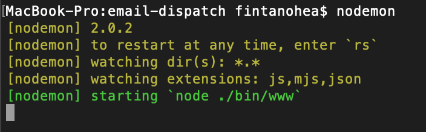
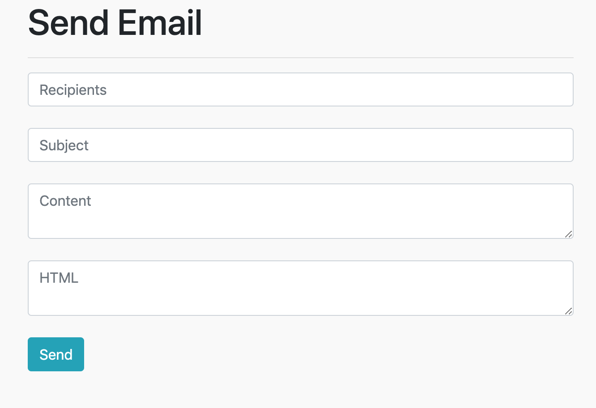
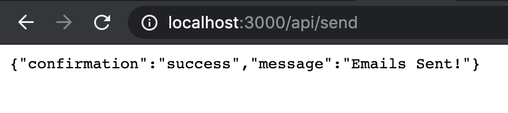

# Express JS Email Dispatch

One Paragraph of project description goes here

## Getting Started

```
git clone https://github.com/fintanohea/email-dispatch.git
cd email-dispatch
npm install
nodemon
```



## Send Email Form
```
localhost:3000
```


## Send Email Success


